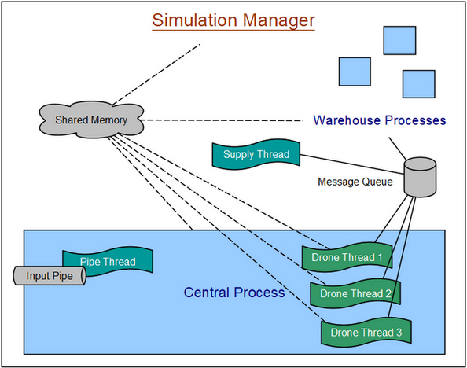

# drone-simulation

Simulation of a system of order delivery, consisting in the coordination of drones and warehouses resources. The program explores management of processes, threads, shared memory, signals and synchronization on Linux. Developed within the scope of Operating Systems course from University of Coimbra.

## Table of Contents
- [Prerequisites](#prerequisites)
- [Build and Run](#build-and-run)
- [Overview](#overview)
- [Software Architecture](#software-architecture)
- [Features](#features)
- [Usage](#usage)
- [Contact](#contact)

## Prerequisites

In order to run the Project on your local machine you need the following requirements:

- Native Linux operating system or running it on virtualization software such as, Virtual Box or WSL2 on Windows
- `GCC` compiler and `make`

To install GCC compiler and make on Debian or Ubuntu:

```bash
$ sudo apt update
$ sudo apt install build-essential
```

## Build and Run

A `makefile` is provided to compile the project. 
To compile and start the simulator: 

```bash
$ make && ./SimulationManager.out
```

## Overview

The system simulates an environment delimited with geospatial coordinates (x, y). The warehouses have a fixed position and are supplied periodically with the product types specified on the configuration file. There are four drone bases to which drones are allocated. Drones move through space seeking to respond to orders. For each order that arrives at the system it is chosen, from among the available drones, the one that guarantees the shortest route to the delivery destination, passing through a warehouse that has the ordered product available in the desired quantity. After loading the materials at the chosen warehouse and unloading them into the defined destination, the drone travels to the nearest base from his position, where it stay still waiting for new orders.  

## Software Architecture




**Simulation Manager**

Creates the shared memory, the central process, the warehouse processes, the message queue and the warehouse supply thread. Receives order and drone command messages and writes them to the named pipe ("*input pipe*"). Upon receiving a SIGUSR1 signal, reads the statistics from the shared memory.

**Central Process**

Creates and coordinates the threads relative to each drone and the pipe thread. The latter is responsible for creating the named pipe, where order and drone message commands are received. The central process processes those messages.

**Warehouse processes**

Each warehouse process is responsible for keeping shared memory up to date in relation to product stocks and monitors the arrival of drones and product supplies through the message queue.

The initial system configurations are described in a file (config.txt) structured as follows:

```
Maximum length (x coordinate), Maximum height (y coordinate)
Product types (separated by commas)
Number of drones 
Supply frequency (in units of time), quantity, unit of time (in seconds)
Number of warehouses
Warehouse name xy: coordinates (x, y) prod: products (type, initial quantity)
```

## Features

- Reception of orders via a named pipe and inter-process communication through a message queue;
- Optimization of the distance travelled in order resolution;
- Synchronized sending of output to log file and screen;
- Concurrency and synchronization support in order handling: semaphores, mutexes and condition variables;
- Update stock and orders statistics in shared memory;
- Display statistical information on the screen in response to SIGUSR1 signal;
- Controlled termination of all processes and threads and release of all resources, upon reception of SIGINT signal (`CTRL` + `C`).

## Usage

The command structure for sending an order request to the system is as follows:

```
$ ORDER order_name prod: product_name, quantity to: x, y
```

Example of order command:

```
$ ORDER Req_1 prod: A, 5 to: 300, 100
```

It is also possible to increase the number of drones in the system:

```
$ DRONE SET new_number
```
<br>
The named pipe is saved in the /tmp folder. In order to send a command directly to the input pipe, open another terminal and type:

```
$ echo "<order/drone command>" > /tmp/input_pipe
```

You can also send a SIGUSR1 signal through this terminal:

```
$ kill -SIGUSR1 <Process PID>
```

## Contact

Created by [@filipamartins](https://github.com/filipamartins) - feel free to contact me through filipa.af.martins@gmail.com.